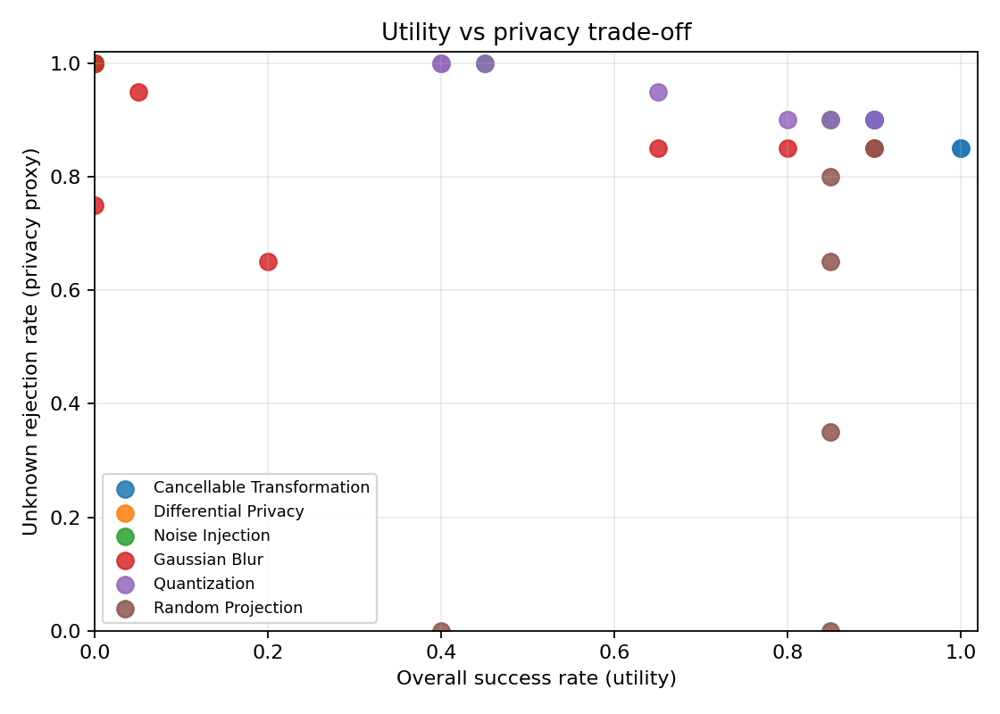
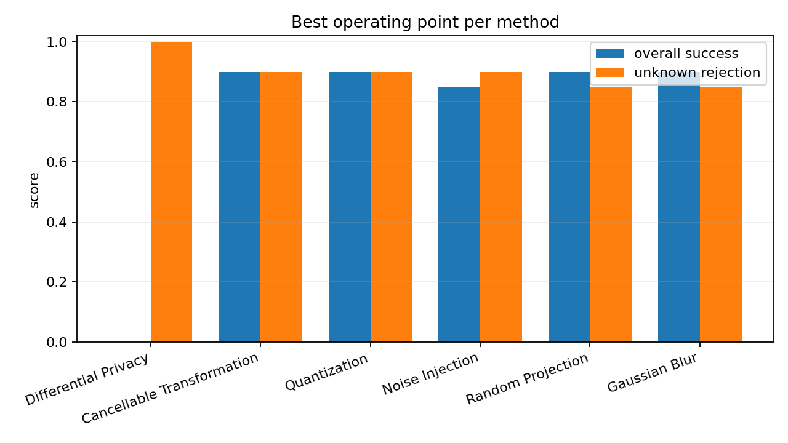
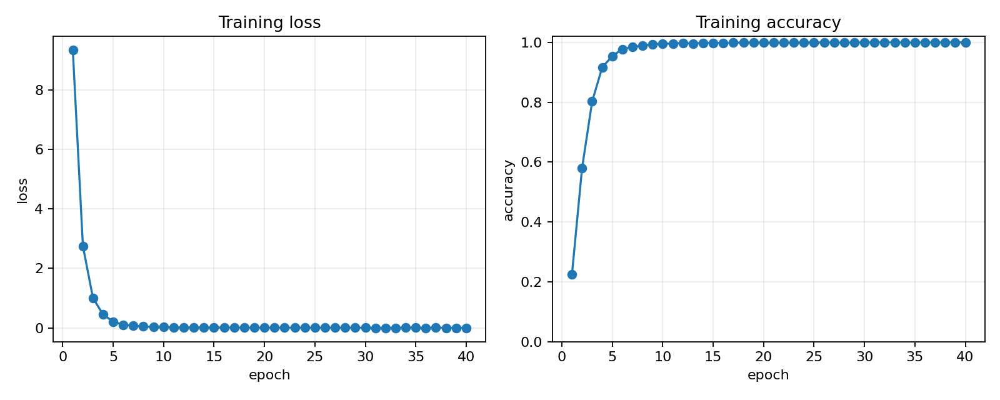
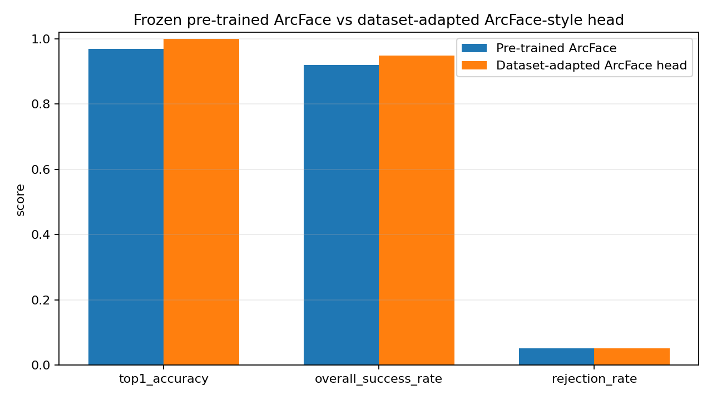

# Results and Conclusions

[Home](index.md) | [Project Scope](project_scope.md) | [Scientific Summary](scientific_summary.md) | [Installation](installation.md)

## Evaluation Protocol

The main comparison benchmark uses:

- `20` known-user test samples,
- `20` unknown-user samples,
- the same decision threshold for all methods,
- a target utility level of `0.80` in **overall success rate**.

### Metrics

- **Top-1 accuracy**: accuracy computed on accepted known-user matches.
- **Rejection rate**: fraction of known-user test images rejected by the threshold.
- **Overall success rate**: `top1_accuracy × (1 - rejection_rate)`.
- **Unknown rejection rate**: privacy proxy measuring how often unknown users are rejected.

This means the main trade-off is:

- **utility** = overall success rate
- **privacy proxy** = unknown rejection rate

## Parameter Sweeps

The compared methods were evaluated with the following anonymization parameters:

- Gaussian Blur: `kernel_size`
- Noise Injection: `sigma`
- Differential Privacy: `epsilon`
- Random Projection: `target_dim`
- Quantization: `levels`
- Cancellable Transformation: `mix_ratio`

## Visual Summary

### Utility vs Privacy Trade-off

### Best Operating Point per Method

## Best Operating Point per Method

| Method | Best parameter at target utility | Overall success rate | Unknown rejection rate | Formal privacy guarantee |
|---|---:|---:|---:|---|
| Cancellable Transformation | `mix_ratio = 0.2` | `0.900` | `0.900` | No |
| Quantization | `levels = 256` | `0.900` | `0.900` | No |
| Noise Injection | `sigma = 0.01` | `0.850` | `0.900` | No |
| Random Projection | `target_dim = 512` | `0.900` | `0.850` | No |
| Gaussian Blur | `kernel_size = 5` | `0.900` | `0.850` | No |
| Differential Privacy | `epsilon = 32` | `0.000` | `1.000` | Yes |

## Interpretation

### Main empirical result

For the chosen utility target (`0.80` overall success rate), the best empirical privacy proxy in the current benchmark is:

- **Cancellable Transformation** with `mix_ratio = 0.2`

At this operating point:

- overall success rate = `0.900`
- unknown rejection rate = `0.900`

Quantization is very close in this benchmark.

### Differential Privacy

Differential Privacy is special:

- it is the **only** method in this project with a **formal privacy parameter**, `epsilon`,
- but in the current benchmark it **did not reach** the target utility level.

Its strongest tested point was:

- `epsilon = 32`
- overall success rate = `0.000`
- unknown rejection rate = `1.000`

This means the current DP implementation is very strong in terms of rejection, but too destructive for recognition utility in the tested setup.

## Suggested Method

Based on the current analysis, the method I would suggest is:

- **Cancellable Transformation**, if the objective is the best practical balance between utility and privacy in the current experiments.

Reason:

- it preserves high utility,
- it strongly rejects unknown users,
- it supports revocability, which is a strong practical property for biometric template protection.

At the same time, I would keep **Differential Privacy** as the main formal-privacy reference method, because it is the only method with a direct privacy control parameter.

## Pre-trained ArcFace vs Dataset-Adapted ArcFace-Style Head

To complement the analysis, I compared:

- the frozen **pre-trained ArcFace** pipeline,
- a **dataset-adapted ArcFace-style head** trained on top of the extracted ArcFace embeddings from the filtered LFW subset.

Important note:

- this is a lightweight dataset-specific adaptation,
- it is **not** a full retraining of the original ArcFace backbone from scratch.

### Training Curves

### Model Comparison

| Model | Top-1 accuracy | Rejection rate | Overall success rate | Mean distance | Embedding dimension |
|---|---:|---:|---:|---:|---:|
| Pre-trained ArcFace | `0.9698` | `0.0507` | `0.9206` | `0.3683` | `512` |
| Dataset-adapted ArcFace head | `1.0000` | `0.0507` | `0.9493` | `0.1631` | `128` |

### Interpretation

The dataset-adapted ArcFace-style head improves the dataset-specific matching metrics on this filtered LFW subset.

This is not surprising because:

- the adaptation is optimized directly on this small dataset,
- the evaluation uses the same dataset split,
- the original pre-trained ArcFace model is much more general-purpose.

So the comparison should be presented carefully:

- **pre-trained ArcFace** remains the stronger general-purpose reference,
- **dataset-adapted ArcFace-style head** is a useful local adaptation experiment on this specific subset.
